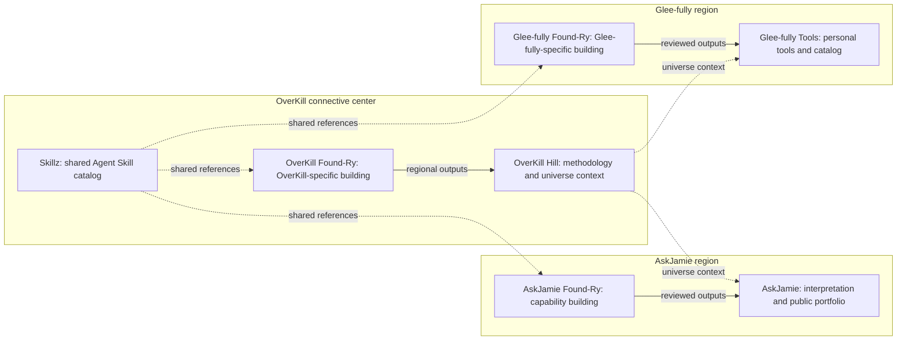

# OKHP3 universe: three regions and seven elements

The owner defines three overlapping rings: AskJamie on the left, OverKill at
the connective center, and Glee-fully on the right. The overlap represents
relationships and shared capability references, not merged product ownership.

The application renders the owner's overlapping-ring arrangement. This flow
map emphasizes responsibilities and reference flows rather than ring geometry.

| Region | Public face | Regional building workbench |
|---|---|---|
| AskJamie | [askjamie.bot](https://askjamie.bot/) | [AskJamie Found-Ry](https://github.com/OKHP3/AskJamie-FoundRy) |
| OverKill | [overkillhill.com](https://overkillhill.com/) | [OverKill Found-Ry](https://github.com/OKHP3/OverKill-Hill-FoundRy) |
| Glee-fully | [glee-fully.tools](https://glee-fully.tools/) | [Glee-fully Tools Found-Ry](https://github.com/OKHP3/Glee-fullyTools-FoundRy) |

[Skillz](https://okhp3.github.io/skillz/) is shared across all three. Its public
contract metadata can be inspected and referenced without executing a skill or
changing its source family. AskJamie brand-specific work stays in AskJamie.

## Authority and historical lineage

Universe governance flows from `OKHP3/OverKill-Hill` to this relay and its
children. Existing manifest `lineage.parent_repo` names OverKill Found-Ry as
historical relay provenance. It does not grant this application ownership of
OverKill Found-Ry or make that regional workshop shared with the other rings.
This interpretation implements the owner's 2026-09-07 direction.

The canonical child catalog is [registry/index.yaml](../registry/index.yaml).
Its entries record governance status, not verified deployment. The local
workbench maintains drafts separately and exports pending registry proposals.
Client overlays and permanent-private records never become public merely
because a package validates or is downloaded.

See [the seven-element research](research/2026-09-07-universe/universe-research.md)
for commit-pinned sources, confirmed functionality and access limitations.
