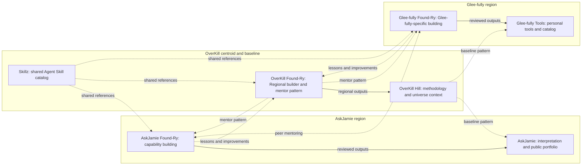

# OKHP3 universe: three regions and seven elements

The owner defines three overlapping rings: AskJamie on the left, OverKill at
the centroid, and Glee-fully on the right. OverKill is the baseline pattern
the distinct sites borrow from or defer to when a question arises. Shared
elements and reciprocal learning connect the regions.

The application renders the owner's overlapping-ring arrangement. This flow
map emphasizes responsibilities and reference flows rather than ring geometry.

| Region | Public face | Regional building workbench |
|---|---|---|
| AskJamie | [askjamie.bot](https://askjamie.bot/) | [AskJamie Found-Ry](https://github.com/OKHP3/AskJamie-FoundRy) |
| OverKill | [overkillhill.com](https://overkillhill.com/) | [OverKill Found-Ry](https://github.com/OKHP3/OverKill-Hill-FoundRy) |
| Glee-fully | [glee-fully.tools](https://glee-fully.tools/) | [Glee-fully Tools Found-Ry](https://github.com/OKHP3/Glee-fullyTools-FoundRy) |

[Skillz](https://okhp3.github.io/skillz/) is shared across all three. Its public
contract metadata can be inspected and referenced without executing a skill or
changing its source family. AskJamie brand-specific work stays in AskJamie.

## Baseline, mentoring and lineage

Universe governance flows from `OKHP3/OverKill-Hill` to this relay and its
children. OverKill Found-Ry is intentionally public and provides the mentor
pattern for AskJamie Found-Ry and Glee-fully Tools Found-Ry. Existing manifest
`lineage.parent_repo` records that relay lineage.

Mentoring is reciprocal. Either regional Found-Ry may develop a better pattern
and mentor OverKill Found-Ry or its peer. Start with the mentor's relevant
pattern, adapt it to regional needs, and offer useful improvements back through
reviewable changes. A lesson can inform another repository without requiring
all three applications to share one runtime or identical features.

This model records the owner's September 7, 2026 clarification. Public status
for OverKill Found-Ry does not change this repository's visibility or existing
client protections.

The canonical child catalog is [registry/index.yaml](../registry/index.yaml).
Its entries record governance status, not verified deployment. The local
workbench maintains drafts separately and exports pending registry proposals.
Client overlays and permanent-private records never become public merely
because a package validates or is downloaded.

See [the seven-element research](research/2026-09-07-universe/universe-research.md)
for commit-pinned sources, confirmed functionality and access limitations.
