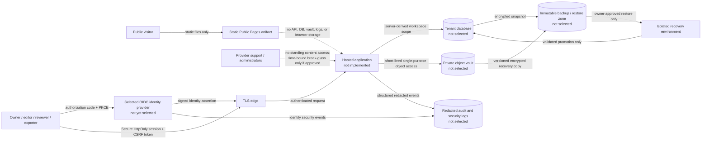

# Threat Model

## Decision status

**Review date:** 2026-09-16  
**Hosted provider:** none selected  
**Current decision:** **NO-GO for hosted implementation and migration**

The owner declined to select or use a hosted provider on 2026-09-15. This model
therefore assesses the approved provider-independent design and defines the
evidence a later, named provider must produce. It does not claim that Replit or
any other provider currently satisfies these controls. The authoring workbench
remains bound to `127.0.0.1`; no workflow, hosted identity, database, object
vault, backup service, or logging pipeline is authorized.

## Project overview

AskJamie Found-Ry is a Python/SQLite authoring workbench for private drafts,
evidence, evaluations, revision history, and governed ZIP exports. A separate
static `public/` artifact contains orientation content only. A possible future
hosted service would support multiple devices or users while preserving strict
workspace and client-record isolation.

## Assets

- **Identity and sessions** — OIDC identities, workspace membership, roles,
  session cookies, revocation state, and MFA assurance.
- **Private authoring records** — source text, evidence, evaluations, revisions,
  client identifiers, privacy flags, and provenance.
- **Packages and recovery data** — generated ZIPs, backups, restore manifests,
  checksums, retention labels, holds, and short-lived download grants.
- **Secrets and keys** — session signing material, database credentials,
  object-vault credentials, and owner-controlled encryption keys.
- **Security evidence** — content-free audit events, access logs, deletion
  reports, incident records, and acceptance reports.
- **Public/private separation** — the guarantee that `public/` and
  `dist/pages/` cannot reach or contain authoring state.

## Trust boundaries

Every arrow is a trust transition. The identity, application, database, vault,
backup, logging, support, and recovery components require a named provider and
provider-specific evidence before the diagram can describe a deployed system.

## Scan anchors

- Production entry points do not exist. The only application entry point is the
  loopback server under `workbench/`; `public/` is static and read-only.
- Highest-risk future surfaces are session middleware, workspace-scoped service
  methods, restore/import, ZIP export, object download grants, support tooling,
  and telemetry redaction.
- `tests/hosted_isolation_harness.py` is the provider-adapter contract.
  `scripts/prove-hosted-isolation.py` reports the local reference result as
  `BLOCKED`, never as host certification.

## Threat assessment and required evidence

| ID | Threat | STRIDE | Required mitigation | Executable acceptance evidence | Accountable owner | Current state |
|---|---|---|---|---|---|---|
| T1 | A valid object ID is used to read, change, export, back up, restore, duplicate, or delete another workspace's data. | Information disclosure, tampering, elevation | Derive workspace from the authenticated server session; scope every service operation and database policy; return the same content-free denial for missing and foreign objects. | Run the two-workspace provider adapter harness for every operation and verify victim state is unchanged. | Application owner; database owner | Reference contract PASS; host evidence NOT RUN |
| T2 | A client supplies another `workspace_id`, role, object owner, or callback context and causes the application to act as a confused deputy. | Spoofing, elevation | Ignore or reject client authority fields; bind issuer/subject, membership, role, and workspace at the server; constrain redirects and callback state to an exact allowlist. | Harness `confused-deputy-claimed-workspace-*` checks plus provider callback tests for altered state, issuer, audience, redirect URI, and role claims. | Identity owner; application owner | Workspace-claim contract executable; provider callback evidence NOT RUN |
| T3 | A stolen, fixed, replayed, or post-logout session permits account impersonation. | Spoofing | Authorization code + PKCE, MFA for owners/admins, rotated short-lived opaque sessions in `Secure`, `HttpOnly`, `SameSite` cookies, CSRF protection, idle/absolute expiry, revocation, and reauthentication for sensitive actions. | Harness revoked-session negative and rotated-session positive controls; provider tests capture cookie flags, fixation resistance, logout/revocation latency, expiry, CSRF denial, and concurrent-session policy. | Identity owner; application owner | Revocation contract executable; provider evidence NOT RUN |
| T4 | A package, backup, or presigned object link remains usable after logout, revocation, expiry, role loss, or workspace removal. | Information disclosure | Use single-purpose, audience-bound, short-TTL grants; no public ACL/cache; recheck authorization before minting; revoke grants on role/session changes; never expose raw backups as routine downloads. | Harness foreign and expired backup/download denials; provider object tests verify TTL, cache headers, ACL, replay denial, and immediate logical revocation. | Object-vault owner; application owner | Logical expiry contract PASS; provider deletion/ACL evidence NOT RUN |
| T5 | A malicious, foreign, expired, corrupted, or commingled recovery point widens access or overwrites production. | Tampering, elevation, denial | Owner approval and reauthentication; signed manifest/checksum; exact workspace and retention labels; isolated restore with egress/public access disabled; full isolation harness before separately approved promotion; never restore over production. | Restore a multi-workspace fixture, verify manifest/schema/checksum/object counts/privacy flags, run all restored-operation isolation checks, then prove isolated cleanup. | Recovery owner; database owner; security owner | Reference restore contract PASS; provider restore and cleanup evidence NOT RUN |
| T6 | Provider support or an administrator reads private content through consoles, snapshots, impersonation, logs, or emergency tooling. | Information disclosure, repudiation | No standing content access; least privilege and separation of duties; owner-approved, time-bound break-glass; reason and ticket required; reauthentication; content-free audit; owner notification; periodic access review. Provider contractual terms must disclose subprocessors and lawful-access handling. | Harness `support-access-denied-*` baseline; provider IAM export, denied-console test, break-glass drill, access-log review, notification evidence, and quarterly entitlement report. | Provider account owner; security owner | No-standing-access contract executable; provider IAM evidence NOT RUN |
| T7 | Logs, traces, metrics, errors, analytics, or support bundles reveal source text, client names, IDs, cookies, authorization headers, packages, or backups. | Information disclosure | Allowlisted structured events; redaction before collection; no request/response bodies; content-free identifiers; restricted retention and access; hostile-value tests at every sink. | Harness `log-redaction` check plus provider canary injection across application logs, edge logs, traces, metrics, crash reports, browser output, and support exports. | Logging owner; application owner; security owner | Reference audit redaction PASS; provider pipeline evidence NOT RUN |
| T8 | Identity email reuse, issuer confusion, weak MFA, or open registration transfers ownership or admits an unauthorized user. | Spoofing, elevation | Key identity by exact `(issuer, subject)`; pin issuer/audience/signature algorithms; disable self-registration and account discovery; owner-maintained allowlist; MFA for privileged roles; audited membership changes. | Provider identity configuration export and tests for changed email, duplicate subject under another issuer, unsigned/wrong-audience tokens, disabled users, and unauthorized registration. | Identity owner | NOT RUN |
| T9 | Application or database credentials permit broad tenant access after one component is compromised. | Elevation, information disclosure | Separate service identities; least-privilege database role; parameterized queries; row-level policy where available; private network path; owner-controlled keys separate from storage; credential rotation and access alerts. | Provider IAM/database policy export, direct cross-tenant query denial, network denial, key-rotation drill, and secret scan. | Platform owner; database owner; key owner | NOT RUN |
| T10 | Public Pages, caches, indexes, or build output become an alternate route to private state. | Information disclosure | Keep public output static; prohibit API/browser-storage dependencies and private markers; no public cache or search indexing of hosted records. | Build and scan both `public/` and `dist/pages/`; inventory public routes and network calls; inspect caches/indexes. | Release owner; application owner | Reference public-artifact check PASS; hosted edge evidence NOT RUN |
| T11 | An attacker exhausts authentication, export, restore, upload, or storage resources. | Denial of service | Per-identity/IP rate limits, bounded bodies and objects, quotas, queue concurrency, timeouts, restore authorization, cost alerts, and tested degradation behavior. | Load and abuse tests demonstrate limits without cross-tenant impact; alerts and recovery runbook are exercised. | Platform owner; incident commander | NOT RUN |
| T12 | A security incident cannot be reconstructed, contained, or communicated without exposing more private data. | Repudiation, information disclosure | Content-free immutable audit events; synchronized clocks; named incident commander; session/key revocation; workspace containment; evidence preservation; provider escalation and owner notification runbooks. | Tabletop exercise and timed drill prove detection, revocation, containment, evidence access, provider escalation, notification decision, and post-incident cleanup within objectives. | Security owner / incident commander | NOT RUN |

## Security guarantees

1. Every private operation MUST require a valid server-side session and MUST
   authorize the session-derived workspace and role at the operation boundary.
2. Browser-supplied workspace, owner, role, visibility, and support fields MUST
   NOT grant authority.
3. Session revocation and sensitive-action reauthentication MUST apply to export,
   restore, membership, policy, deletion, and download-grant creation.
4. Database rows, objects, backups, restores, caches, indexes, and audit events
   MUST have an owning workspace or be rejected.
5. Support personnel MUST have no standing access to private content. Any later
   break-glass path requires separate owner approval and auditable controls.
6. Logs and support artifacts MUST exclude private payloads and credentials
   before they cross into the logging boundary.
7. Restores MUST occur in a disposable isolated environment and MUST NOT be
   promoted until integrity, privacy, and workspace-isolation checks pass.
8. Public artifacts MUST remain static and unable to reach hosted authoring
   state.

## Residual risks

| Risk | Why it remains | Required disposition |
|---|---|---|
| Provider control-plane compromise or lawful access | Customer IAM and encryption reduce but cannot eliminate provider/operator access, metadata exposure, or compelled access. | Owner accepts only after reviewing provider contracts, subprocessors, data location, support controls, and owner-controlled key capabilities. |
| Browser/device compromise | `HttpOnly` cookies reduce token theft but cannot prevent actions from an already compromised authenticated device. | Require MFA, short sessions, reauthentication, session inventory/revocation, and user guidance; owner records acceptance. |
| Downloaded package copies | Once an authorized user downloads a package, provider deletion and link revocation cannot erase that copy. | Interface warning, audit event, minimum export role, and owner-approved handling policy. |
| Backup deletion delay | Logical deletion can precede physical expiry in replicas and disaster-recovery media. | Provider must state maximum deletion windows and supply completion evidence; UI reports deletion pending until then. |
| Novel application defects | Contract tests cover named paths but cannot prove absence of all authorization or injection defects. | Security review, dependency/SAST scans, route inventory, negative tests, and staged synthetic-data pilot remain required. |
| Incident-response dependency | Detection and containment depend on the selected identity, host, vault, and logging providers being available during an incident. | Test provider escalation and owner-controlled revocation paths; document offline contacts and evidence export. |

## Go/no-go conditions for owner review

### GO requires all of the following

- A named identity, application host, database, object vault, backup service,
  logging service, data location, and disaster-recovery region.
- A named human owner for every owner role in the threat table; one person may
  hold multiple roles, but no responsibility may remain assigned only to a
  vendor.
- Provider contracts and configuration evidence for deletion, subprocessors,
  support access, encryption, owner-controlled keys, retention, and incident
  escalation.
- The provider adapter report is `PASS` in a disposable environment using only
  synthetic fixtures, including the session, confused-deputy, support, stale
  link, restore, log, package, and cross-workspace checks.
- Identity callback/session tests, database/IAM policy tests, object ACL/cache
  tests, hostile log-canary inspection, restore cleanup evidence, and an
  incident-response drill all pass.
- Security review finds no unresolved critical or high issue. Every lower issue
  has a named owner, deadline, and explicit owner acceptance.
- The owner separately authorizes implementation. Each existing draft migration
  then requires per-project opt-in and a verified rollback plan.

### NO-GO if any of the following is true

- Any provider or accountable owner is unnamed.
- Provider certification is `NOT_RUN`, `BLOCKED`, or `FAIL`.
- Cross-workspace access, claimed-workspace confusion, revoked-session access,
  stale-link retrieval, standing support access, restore commingling, or log
  canary leakage succeeds.
- Encryption keys are provider-managed only, deletion behavior is undocumented,
  a private data class can enter public output, or restore must overwrite
  production.
- Real drafts or client records are required to complete pre-approval testing.
- Loopback operation would be removed or existing drafts would migrate without
  explicit per-project owner opt-in.

## Current adjudication

The current state is **NO-GO**. The local reference harness can demonstrate that
the provider-independent contract is executable, but it cannot certify any
hosted trust boundary. This status may change only after provider selection,
provider-specific evidence, review of the residual risks, and separate owner
approval. Until then, migration remains unauthorized.